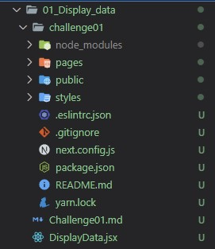

# ReactJS-Challenges

All the challenges are in different directories.
The challenges include one possible solution to the problem/challenge.

The challenge is in the codependend directory in a Markdown-File.

# How to start

To start the challenge you need to create a NextJS Application. 
It is recommended to create a new directory in the challenge directory and have your **NextJS** application in it. 
 
In the NextJS folder execute the following command `npx create-next-app .` 
**It is important to not forget the dot(.) in the command.** 
 
After the command is completed the directory structure of the challenge could look like this (depends on where you created your project directory): 
 
 
The <i>DisplayData.jsx</i> does not affect the project at all.
If you want to use the predefined file just copy and paste it into the components directory which you have to create first. 
 
If you open the file pages/index.js and the first letter in the file is red underlined, then you should replace the <i>.babelrc</i> and <i>.eslintrc.json</i> in the challenge directory with the files from the **docs directory**.